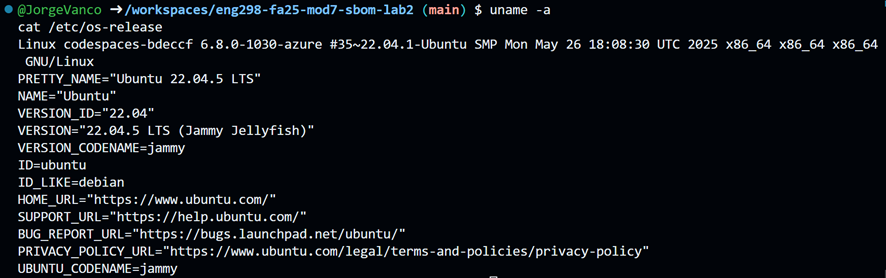
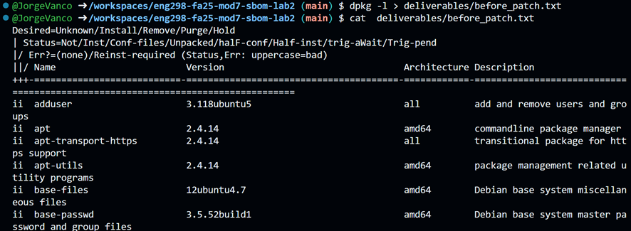
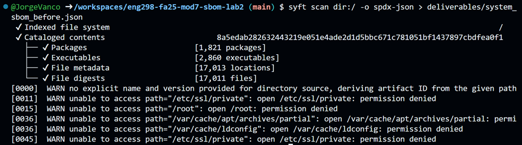
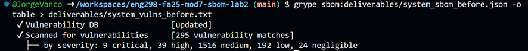
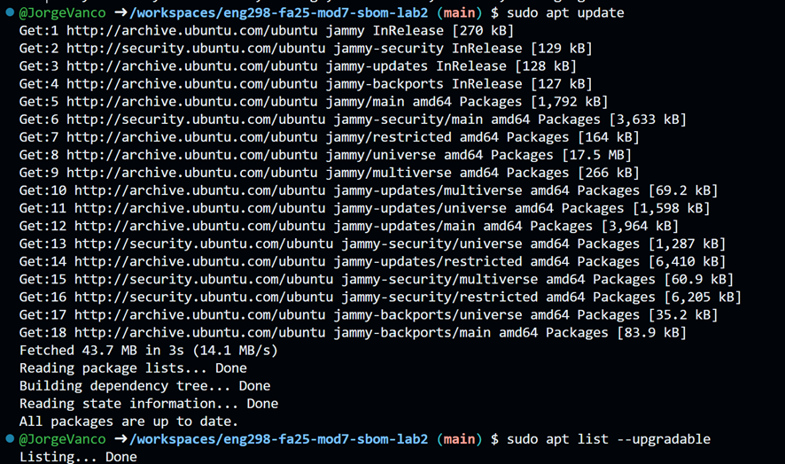

We first check the Linux and Ubuntu version:

We then view currently installed packages and save the output in before_patch.txt inside the deliverables folder:

Use Syft to create a system-level SBOM of APT-managed packages:
syft scan dir:/ -o spdx-json > deliverables/system_sbom_before.json

Use Grype to scan the SBOM for known vulnerabilities:
grype sbom:deliverables/system_sbom_before.json -o table > deliverables/system_vulns_before.txt

It detected 291 packages. There are 32 vulnerabilities with High severity, 83 with Medium, 155 with Low, and 9 with Critical.
This machine is already up to date.

I decided to check CVE-2023-24538, which is a Critical vulnerability:
A critical vulnerability in Go's html/template package arises because backticks are not properly treated as JavaScript string delimiters, allowing attackers to terminate a string literal and inject arbitrary JavaScript code. This flaw permits code injection (potentially leading to cross-site scripting or remote code execution depending on context) without requiring user interaction or privileges, giving it a critical severity rating.

I got Listing... done. After running the update commands, so this machine is already up to date.

1. How does maintaining updated packages illustrate complete mediation?
Complete mediation requires that every access to every resource be checked for authority and integrity. By maintaining updated packages, you ensure that the code responsible for these checks is free from known vulnerabilities that could otherwise allow attackers to bypass security controls and access restricted resources.

2. Why is generating a new SBOM after patching essential to assurance?
Generating a new SBOM after patching provides a verifiable "ground truth" of the system's new state, confirming that vulnerable components were actually removed and replaced. This step moves security from assumption ("I ran the update command") to assurance ("I can prove the vulnerable library is gone"), which is critical for maintaining trust in the system.

3. What risks persist when organizations delay system updates?
Delaying updates leaves known vulnerabilities (CVEs) exposed to attackers who can exploit public proof-of-concept code to compromise the system. This creates a "window of exposure" where the system is defenseless against known threats, increasing the likelihood of data breaches, ransomware, or unauthorized access.

4. How does this exercise embody the secure design lifecycle principle?
This exercise treats security as a continuous cycle of assessment, action, and verification rather than a one-time event. By establishing a baseline (SBOM), identifying risks (Grype), mitigating them (patching), and verifying the result (re-scanning), it demonstrates how security is integrated into the ongoing maintenance and lifecycle of the software.